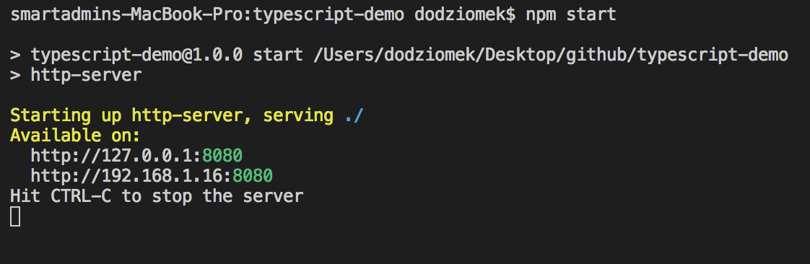

# Typescript-Demo

Typescript / ES6 inheritance in action

## Getting Started

Clone / download the project, start server and play with the basic app:

<p align="center">
  
</p>

### Prerequisites

To make this example work you need to have typescript installed on your machine.

```
$ npm install -g typescript
```

### Installing

After cloning go to the project directory and install all dependencies

```
$ npm install
```

Then you should be able to start the local web server by command

```
$ npm start
```

<p align="center">
  
</p>

Open browser and go the the localhost adress displayed after starting web server, by default it is http://localhost:8080/ . You should see working website.

## Running the app

You can play, modify something in .ts files and see changes in the app. To do this you need to build app after making changes. You can use for it created task for Visual Studio Code. Just use shortcut: cmd + shift + b or task manager and execute command: Tasks: Run Build Task:

<p align="center">
  
</p>

## Built With

* [Typescript](https://www.typescriptlang.org/) - Typed superset of javascript that compiles to plain javascript
* [Bulma](https://bulma.io/) - Modern CSS framework based on Flexbox
* [jQuery](https://jquery.com/) - Fast, small, and feature-rich JavaScript library
* [SystemJS](https://github.com/systemjs/systemjs) - Configurable module loader enabling dynamic ES module workflows in browsers and NodeJS
* [Http-Server](https://www.npmjs.com/package/http-server) - Simple, zero-configuration command-line http server

## Authors

* **Dariusz Odziomek** - (https://www.linkedin.com/in/darekodz/)

## License

This project is licensed under the MIT License - see the [LICENSE](LICENSE) file for details
